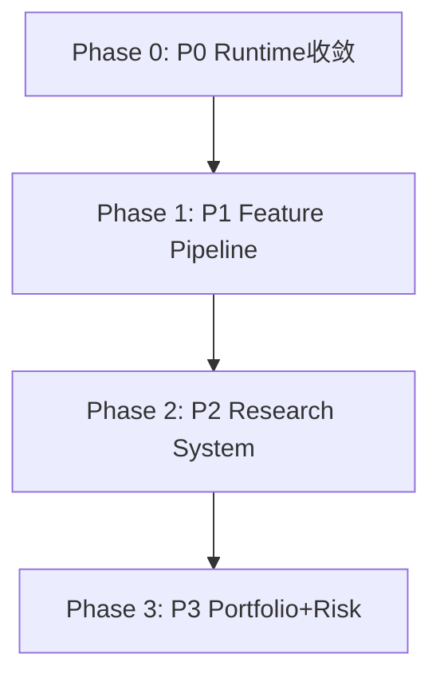

# 统一事件驱动的量化研究与交易操作系统 - 实现方案

## 📋 目录
- [现状分析](#现状分析)
- [分阶段实现计划](#分阶段实现计划)
- [Phase 0: P0 - Runtime 完整收敛](#phase-0-p0---runtime-完整收敛)
- [Phase 1: P1 - Feature Pipeline 标准化](#phase-1-p1---feature-pipeline-标准化)
- [Phase 2: P2 - Research System 完善](#phase-2-p2---research-system-完善)
- [Phase 3: P3 - Portfolio + Risk Engine](#phase-3-p3---portfolio--risk-engine)

---

## 现状分析

### ✅ 已实现的核心组件

| 领域 | 组件 | 状态 |
|------|------|------|
| **架构** | 6层架构 (API/APPLICATION/RUNTIME/SERVICES/DOMAIN/INFRASTRUCTURE) | ✅ 完成 |
| **Runtime** | RuntimeOrchestrator, RuntimeBus, 10+ 领域 Runtime | ✅ 完成 |
| **事件** | UnifiedEvent, Time Authority | ✅ 完成 |
| **特征** | FeatureAvailabilityGuard, FeatureMatrix, HistoricalMaterializer | ✅ 完成 |
| **研究** | WalkForwardEngine, RealityEngine | ✅ 完成 |
| **回测** | ReplayRuntime | ✅ 完成 |

### 📉 需要完善的部分

| 优先级 | 目标 | 完成度 |
|--------|------|--------|
| **P0** | Runtime 完整收敛 (Event Protocol, Replay=Live) | 65% |
| **P1** | Feature Pipeline 标准化 | 55% |
| **P2** | Research System 完整工具链 | 40% |
| **P3** | Portfolio + Risk Engine | 35% |

---

## 分阶段实现计划

---

## Phase 0: P0 - Runtime 完整收敛 🔥

### 目标
确保 Replay ≈ Live，Event Protocol 完整，Time Semantics 严格

### 0.1: 统一事件流转机制完善
- **任务 1.1**: 完整的 Event Flow 验证器
- **任务 1.2**: 事件流转审计日志
- **任务 1.3**: 事件溯源追踪

### 0.2: Immutable Event 机制
- **任务 2.1**: Immutable Event 数据结构
- **任务 2.2**: 事件修改检测
- **任务 2.3**: 事件验证链

### 0.3: Replay=Live 验证套件
- **任务 3.1**: 端到端行为验证
- **任务 3.2**: 特征输出比对
- **任务 3.3**: 信号输出比对

---

## Phase 1: P1 - Feature Pipeline 标准化

### 目标
统一 Raw Data → Event → Feature → Feature Store → Strategy 的完整流程

### 1.1: 实时特征物化完善
- **任务 1.1**: RealtimeMaterializer 优化
- **任务 1.2**: Feature Registry 完善
- **任务 1.3**: 特征版本管理

### 1.2: Feature Store 统一
- **任务 2.1**: 实时特征存储
- **任务 2.2**: 特征检索优化
- **任务 2.3**: 特征血缘追踪

---

## Phase 2: P2 - Research System 完善

### 目标
完整的量化研究工具链：Walk Forward、Cross Validation、Purged CV、Feature Importance、Regime Segmentation、Experiment Tracking

### 2.1: 验证工具完善
- **任务 1.1**: Purged Cross Validation
- **任务 1.2**: Combinatorial Purged CV

### 2.2: 特征分析
- **任务 2.1**: Feature Importance
- **任务 2.2**: 特征衰减分析
- **任务 2.3**:  regime 识别

### 2.3: 实验跟踪
- **任务 3.1**: Experiment Tracker
- **任务 3.2**: 结果对比

---

## Phase 3: P3 - Portfolio + Risk Engine

### 目标
完善的组合管理和风控引擎

### 3.1: Portfolio Engine
- **任务 1.1**: 动态仓位分配
- **任务 1.2**: 组合再平衡

### 3.2: Risk Engine
- **任务 2.1**: VaR 计算
- **任务 2.2**: 仓位限制
- **任务 2.3**: 风险归因

---

## 关键设计原则

### 1. 依赖方向严格
- API → APPLICATION → RUNTIME/SERVICES → DOMAIN/INFRASTRUCTURE
- 绝不反向依赖

### 2. State Ownership
- 每个领域状态仅由对应 Runtime 持有
- 其他层只能通过 Query 读取

### 3. Time Authority
- runtime/ 层必须使用 RuntimeClock
- 其他层可以使用 datetime

### 4. Replay = Live
- 回测和实盘使用同一套 Runtime
- 执行层唯一差异点

---

## 验收标准

### P0 验收
- [ ] 端到端事件流转审计完整
- [ ] Replay=Live 验证通过率 ≥ 99%
- [ ] 数据泄漏检测 0 阳性

### P1 验收
- [ ] Feature Pipeline 端到端完整
- [ ] 特征版本管理可用
- [ ] 特征血缘追踪可用

### P2 验收
- [ ] WalkForward + PurgedCV 可用
- [ ] Feature Importance 计算
- [ ] 实验跟踪系统可用

### P3 验收
- [ ] Portfolio Engine 可用
- [ ] Risk Engine 可用
